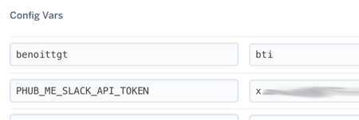

# Phubme

[](https://travis-ci.org/benoittgt/PhubMe)

Notify a slack user when the user is mentionned in a github comment.

## Installation

[](https://heroku.com/deploy)

Or get the project and :
```sh
$ mix deps.get
$ iex -S mix run --no-halt
```
You can specify the `PORT` using env variable. By default it's 8080.

## Setup

### Slack
To use PhuMe you need to get first a bot token from Slack. [Create one](https://api.slack.com/bot-users) and get the token.
Set this token to the env variables `PHUB_ME_SLACK_API_TOKEN`.

### Nicknames
As slack token. Nicknames need to be set as env variables. **Export variables without `@`** :
```sh
export mynicknameongithub=mynicknameonslack
```

In Heroku it looks like this :



Github nickname on the left, slack nickname on the right.

### Github webhook

Then in github in webhooks add configuration for your Phubme. `https://myserver.io/phubme`, `application/json` only "Issue comment".

Then try it.

Feel free to open issue and PR.

